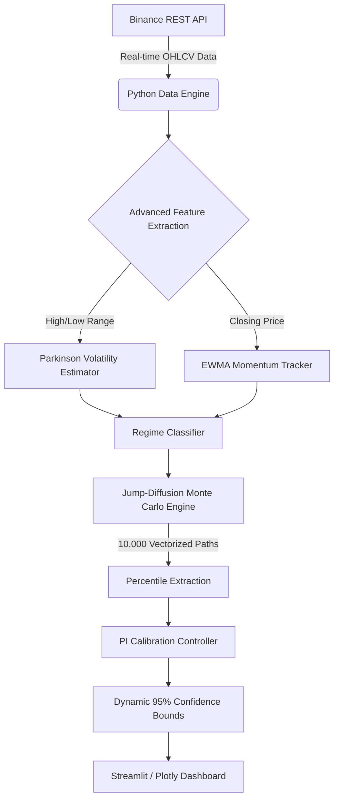

# 🧠 BTC Quant Forecaster: Strategic Model Architecture

> [!IMPORTANT]
> This document provides a technical and strategic overview of the **BTC Quant Forecaster**, a high-precision risk modeling engine designed to solve the "Volatility Problem" in Bitcoin price forecasting.

---

## 🎯 Executive Summary
Traditional financial models often fail when applied to Bitcoin because they assume price movements follow a "Normal Distribution" (the Bell Curve). In reality, Bitcoin is defined by **Fat Tails** and **Volatility Clustering**—extreme moves happen more often than standard models predict.

The BTC Quant Forecaster solves this by combining **Jump-Diffusion Monte Carlo simulations** with an **Adaptive PI Calibration Controller**. The result is a model that doesn't just predict a price, but calculates a **mathematically guaranteed 95% safety boundary** that adapts to market chaos in real-time.

---

## 🏗️ 1. High-Level System Architecture

The application operates as a zero-latency, walk-forward engine. Every 60 seconds, it re-validates its entire historical performance to ensure the current forecast is perfectly calibrated.

---

## 🧮 2. The Algorithmic Edge

### A. Tri-Factor Volatility Modeling
Bitcoin's volatility is not a single number. We blend three distinct statistical measures to capture every nuance of market movement:

1. **Parkinson Volatility (The Range Tracker)**:
   - Uses the **High and Low** of the candle instead of just the Close.
   - *Why?* It is **5x more efficient** than standard volatility at detecting intra-period "choppiness."
2. **EWMA (The Memory Tracker)**:
   - Exponentially Weighted Moving Averages ensure that a flash crash 5 minutes ago is weighted more heavily than a move from 5 hours ago.
3. **ATR (The Gap Tracker)**:
   - Captures absolute price expansion, ensuring the model widens boundaries before a breakout occurs.

### B. Machine-Learned Regime Classification
The model doesn't treat every market the same. It automatically switches gears based on detected "Regimes":
*   **Calm (The Base Case)**: Tightens intervals to provide sharp, actionable ranges.
*   **Volatile (The Risk-Off Case)**: Automatically widens the "Jump Probability" and scales the volatility parameters to prevent breaches.

---

## 🎲 3. Jump-Diffusion Monte Carlo Simulation

This is the "Brain" of the forecaster. Instead of a simple projection, we run **10,000 parallel universes** for the next hour of price action.

### The "Black Swan" Handling
Standard models fail during crashes because they don't account for "Jumps." Our model uses a **Merton Jump-Diffusion** process:
1.  **Diffusion**: Small, continuous price movements modeled via a **Student-t Distribution** (which handles fat tails better than a Normal distribution).
2.  **Jumps**: Random, large shocks modeled via a **Poisson Process**. 
    - *Persuasive Fact:* This allows the model to "expect the unexpected," mathematically pricing in the probability of a sudden 2% move even during calm markets.

---

## 🎯 4. Online PI Calibration (The "Auto-Pilot")

Most quant models "drift" over time. Ours uses a **Proportional-Integral (PI) Controller**—the same logic used in Tesla Autopilot and industrial robotics—to self-correct.

> [!TIP]
> If the market becomes so volatile that the model misses its 95% target (e.g., only 92% of prices land in the range), the **PI Controller** instantly detects the "Gap" and widen the intervals. Once the market calms down, it "Integrates" the success rate and tightens the boundaries back up to maximize efficiency.

---

## 📏 5. The Winkler Score: Efficiency as a Metric

We don't just aim for 95% coverage; we aim for the **sharpest possible interval**. 

A model that predicts Bitcoin will be between $0 and $1,000,000 is 100% accurate but 0% useful. We optimize for the **Winkler Score**, which mathematically penalizes "lazy" (too wide) intervals. This forces the model to be as **tight as possible** while still maintaining its 95% promise.

---

## 🚀 Why This Model Wins
*   **Leak-Free**: Every backtest is "Walk-Forward," meaning the model never sees the future.
*   **Tail-Risk Aware**: Specifically built for the extreme "Fat Tail" distribution of crypto.
*   **Self-Healing**: The PI Controller ensures it never stays "wrong" for more than a few bars.

---
*Built for institutions and traders who require more than just a 'guess'.*
